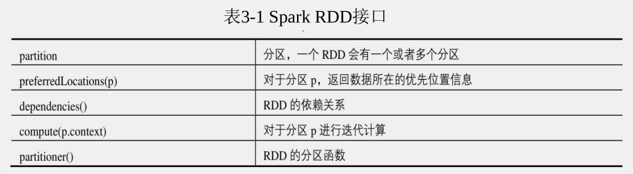

# Spark大数据分析技术与实战

## 楔子

> 之前了解的一些内容，此处直接从RDD编程开始学习。目前我接触的是java，对于书中的scala例子，有些转换为了java版本，有些没找到相应的API.


# 3 RDD编程

​	Spark是基于内存的大数据综合处理框架，为大数据处理提供了一个一体化解决方案，而该方案的设计与实现都是基于一个核心概念展开的，即弹性分布式数据集（Resilient Distributed Dataset，RDD）。RDD可以理解为由若干个元素构成的分布式集合以及其上的操作，它是Spark中数据的重要组织形式。与MapReduce不同，Spark针对RDD提供了更加丰富的操作，而不只局限于Map和Reduce，用户利用这些操作可以非常方便地编写出复杂的业务逻辑，然后Spark会自动将RDD中的数据与相关任务分发到集群上，并行化地去执行。


## 3.1 RDD定义

​	Apache将RDD定义为弹性分布式数据集，它是Spark应用程序中数据的基本组织形式。弹性意味着RDD能够自动地进行内存和磁盘数据存储的切换，并且具有非常高的容错性；分布式说明RDD是一个存储在多个节点上的海量数据集合。RDD是一种高度受限的共享内存模型，即RDD是只读的记录分区的集合。RDD具有自动容错、位置感知调度和可伸缩性等数据流模型的特点。

​	

## 3.2 RDD的特性

​	Spark在定义和描述RDD的时候，通常会涉及以下五个接口



### 3.2.1分区

 	RDD中的数据可能是TB、PB级别的，完全基于一个节点上的存储与计算并不现实。Spark基于分布式的思想，先将RDD划分为若干子集，每个子集称为一个分区（partition）。分区是RDD的基本组成单位，与MapReduce中的split类似。对于一个RDD，Spark以分区为单位逐个计算分区中的元素。分区的多少决定了这个RDD进行并行计算的粒度，因为对RDD中每一个分区的计算都是在一个单独的任务中执行的。用户可以显示指定RDD的分区数目，若不指定Spark将会采用默认值（即CPU核数）。

```java
 /**
 * 设置分区数量
 */
private static void setPart() {
	JavaSparkContext sparkContext = SparkUtils.getJavaSparkContext();
	// // 指定RDD分区数量 4个分区
	JavaRDD<String> rdd = sparkContext.parallelize(Arrays.asList("hello", "spark"), 4);
	int size = rdd.partitions().size();
	System.out.println("分区数量是：" + size);
	// 分区数量是：4
}

```


### 3.2.2 依赖

​	RDD是易转换、易操作的，这意味着用户可以从已有的RDD转换出新的RDD。新、旧RDD之间必定存在着某种联系，这种联系称为RDD的依赖关系。RDD间的依赖关系是Spark中的一个重要概念，是Spark进行容错、优化与任务调度的基础。

​	RDD依赖分为宽依赖和窄依赖：

​	窄依赖：父RDD的每个分区最多被其子RDD的一个分区所依赖，也就是说子RDD的每个分区依赖于常数个父分区，子RDD每个分区的生成与父RDD的数据规模无关。

​	宽依赖：父RDD的每个分区被其子RDD的多个分区所依赖，子RDD每个分区的生成与父RDD的数据规模相关。

​	`窄依赖关系使得数据的容错与恢复非常方便；而对于宽依赖关系，子RDD的一个分区出错会导致其对应父RDD的多个分区进行重新计算，过程类似于MapReduce的Shuffle操作，代价非常高。`


### 3.2.3 计算

​	Spark 中每个 RDD中都包含一个函数，即在父 RDD上执行何种计算后得到当前 RDD。每个RDD的计算都是以分区为单位的，而且每个RDD中的计算都是在对迭代器进行复合，不需要保存每次计算的结果。


### 3.2.4 分区函数

​	对于KEY-VALUE形式的RDD,Spark允许用户根据关键字key指定分区顺序，这是一个可选的功能。目前支持哈希分区和范围分区，这一特性有助于提高RDD之间某些操作的执行效率，例如可指定将两个RDD按照同样的哈希分区进行分区(将同一机器上具有相同关键字的记录放在同一分区)，当这两个RDD之间执行join操作时，会简化Shuffle过程，提高效率。

### 3.2.5 优先位置

​	RDD优先位置属性与Spark中的作业调度与管理密切相关，是RDD中每个分区所存储的位置。遵循“移动计算不移动数据”这一理念，Spark在执行任务时尽可能地将计算分配到相关数据块所在的节点上。以从Hadoop中读取数据生成RDD为例，preferredLocations返回每一个数据块所在节点的机器名或者IP地址，如果每一块数是多份存储的，那么将返回多个机器地址。

## 3.3 创建操作

​	RDD中封装的操作非常丰富，可以大致分为转换操作（Transformation）和执行操作（Action）两类。在已知RDD上执行转换操作可返回一个新的RDD；而执行操作则是向驱动器程序返回结果或把结果写入外部系统。转换操作采用了惰性策略，即转换操作并不会立即被计算，其相当于对业务逻辑的一种抽象描述，只有提交执行操作时，才会真正触发对转换操作的计算。

​	通常得到一个RDD有3种方式：对驱动程序中集合的并行化处理、读取外部存储系统(HDFS HBASE HIVE)、基于现有的RDD的转换。


### 3.3.1 基于集合的创建操作

​	 

```java
sparkContext.parallelize(Arrays.asList(1, 2, 3, 4, 5));
```


### 3.3.2 基于外部存储的创建操作

```java
/**
 * 示例 3-7 创建分区数为4的RDD
 */
static void readFileToRDD() {
	String filePath = "data/txt/20.TXT";
	JavaRDD<String> textFile = sparkContext.textFile(SparkUtils.getFilePath(filePath), 4);
	System.out.println(textFile.partitions().size());
}

```

### 3.4 常见执行操作

​	执行操作是向应用程序返回值或向存储系统导出数据的操作，常见的有 first  count collect take等

## 3.5 常见转换操作

​	转换操作是能够从已有的RDD得到新的RDD。Spark提供了丰富的转换操作。

​	

### 3.5.1 一元转换操作

​	

- map 不做解释了，

- mapValues——适用于Key-Value对形式的RDD，即RDD中的每个数据都是有序二元组。针对key-value对中的每个value值进行制定的函数运算(一对一映射)，得到新的value，所有新的key-value构成新的RDD


  ```java
  static void transMapValue() {
  	JavaRDD<String> rdd = sparkContext.parallelize(Arrays.asList("dog", "tiger", "loin", "cat", "panther", "eagle"));
  	JavaRDD<Tuple2<Integer, String>> map = rdd.map(t -> new Tuple2<Integer, String>(t.length(), t));
  	System.out.println(map.collect());
  }
  ```


- flatMap 与map类似，针对RDD中的每个元素，经过制定的函数(一对多映射)运算后生成若干个新元素。


- groupByKey 针对key-value对形式RDD，以KEY值作为依据，对value值进行分组
- reduceByKey 针对Key-Value形式的RDD，对具有相同key的value进行制定的函数运算。再把计算结果与key值组成一个新的key-value对。


### 3.5.2 二元转换操作

- union 将两个RDD中的元素进行合并，将结果封装成新的RDD，类似于讲个集合的合并运算。
- intersection 类似集合的交运算


# 5 GraphX

​	