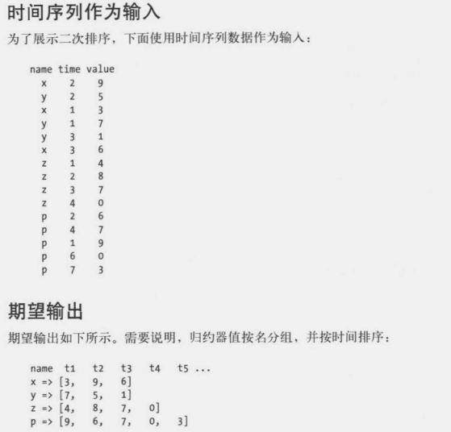

# 数据算法  Hadoop Spark大数据处理技巧

## 楔子

> 我只是学习Spark，不考虑Hadoop部分


# 1 二次排序：简介

​	二次排序(secondary sort) 问题是指归约阶段与某个键关联的值排序。有时这也称为值键转换(value-key conversion)。利用二次排序技术，可以传入各个归约器的值完成排序。

​	

## 二次排序问题解决方案

​	归约器值排序至少有2种方案。这些使用hadoop和Spark都可以应用。

- 第一种：让归约器读取和缓存给定键的所有值，然后对这些值完成一个归约器中排序。这种方法不具有可伸缩性，因为归约器要接收一个给定键的所有值。这种方法可能导致归约器耗尽内存，另一方面，如果数量很少，不会导致内存溢出错误，那么这种方法是适用的。
- 第二种：使用Mapreduce框架对归约器值排序。这种方法“会为自然键增加或整个值来创建一个组合键完成归约器中排序”。这种方法可伸缩，不会内存溢出。


### 实现细节

----------

​	要实现二次排序，还需要一个Java插件类。我们要告诉Mapreduce/Hadoop框架：

1. 如何对归约器键排序
2. 如何对传入归约器的键分区
3. 如何对到达各个归约器的数据分组

## Spark的二次排序解决方案

在Spark中解决二次排序问题，至少要2种方案：


方案1：

​	将一个给定键的所有值读取并缓存到一个List数组结构中，然后对这些值完成归约器中排序。如果每个归约器键的值集很小(完全可以放在内存中)。这种是可以的

方案2：

​	使用Spark框架对归约器值排序(这种做法不需要对传入归约器的值完成归约器中排序)。这种方法"会为自然键增加部分或整个值来创建一个组合键以实现排序目标"。这种方法是可伸缩的。




### 方案一：内存中实现二次排序

------------

​	由于Spark有一个非常强大的高层API，这里将用一个Java类提供整个解决方案。SparkAPI 建立在弹性分布式数据集基本抽象概念基础上，要充分利用Spark API,首先必须理解RDD，RDD<T>类包含了所有RDD可用的基本MapReduce操作。JavaPairRDD<k,v>类则包含了mapTopPair、flatMapToPair和groupByKey等MapReduce操作。


#### 步骤

1. 导入需要的包
2. 输入数据并验证(我操作时数据规则，就不做验证了)
3. 创建JavaSparkContext对象。
4. 使用JavaSparkContext为上下文创建一个RDD。得到的RDD将是JavaRDD<String> ,这个rdd各个元素分别是name,time,value
5. 从javaRDD创建键值对，键是name，值是(time,value)。得到新的RDD
6. 按照键（name）对JavaPairDD元素分组
7. 对归约器值排序得到最终输出


```java
import java.util.ArrayList;
import java.util.Collections;
import java.util.List;

import org.apache.spark.api.java.JavaPairRDD;
import org.apache.spark.api.java.JavaRDD;
import org.apache.spark.api.java.JavaSparkContext;
import org.apache.spark.api.java.function.Function;
import org.apache.spark.api.java.function.PairFunction;
import org.apache.spark.storage.StorageLevel;

import scala.Tuple2;

import com.google.common.collect.Lists;
import com.zhuzi.utils.SparkUtils;

/**
 * @Title: SortBySpark.java
 * @Package com.zhuzi.bookj.char01
 * @Description: TODO(spark排序 方案1 内存中实现二次排序)
 * @author 作者 grq
 * @version 创建时间：2018年11月28日 下午1:58:39
 *
 */
public class SortBySpark {
	@SuppressWarnings("serial")
	public static void main(String[] args) {
		String filePath = SparkUtils.getFilePath("data/j/char01_sort.txt");

		// 步骤3 创建JavaSparkContext 对象
		JavaSparkContext sparkContext = SparkUtils.getJavaSparkContext();
		// 步骤4 使用JavaSparkContext为上下文创建一个RDD。得到的RDD将是JavaRDD<String>
		// ,这个rdd各个元素分别是name,time,valu
		JavaRDD<String> lines = sparkContext.textFile(filePath, 1);
		for (String string : lines.collect()) {
			// System.out.println(string);

		}
		// 步骤5 从javaRDD创建键值对，键是name，值是(time,value)。得到新的RDD(为了方便我直接使用字符串)
		JavaPairRDD<String, Tuple2<String, String>> pairRDD = lines.mapToPair(new PairFunction<String, String, Tuple2<String, String>>() {
			@Override
			public Tuple2<String, Tuple2<String, String>> call(String s) throws Exception {
				String[] tokens = s.split(" ");
				Tuple2<String, String> value = new Tuple2<String, String>(tokens[1], tokens[2]);
				return new Tuple2<String, Tuple2<String, String>>(tokens[0], value);
			}
		});
		for (Tuple2<String, Tuple2<String, String>> pairTemp : pairRDD.collect()) {
			// System.out.println(pairTemp);
		}

		// 步骤 6 按照键（name）对JavaPairDD元素分组

		JavaPairRDD<String, Iterable<Tuple2<String, String>>> groupByKey = pairRDD.groupByKey().sortByKey();
		for (JavaPairRDD<String, Iterable<Tuple2<String, String>>> temp : Lists.newArrayList(groupByKey)) {
			List<Tuple2<String, Iterable<Tuple2<String, String>>>> collect = temp.collect();
			for (Tuple2<String, Iterable<Tuple2<String, String>>> tuple2 : collect) {
				System.out.println("------step 6--->" + tuple2);
			}
		}
		// (z,[(1,4), (2,8), (3,7), (4,0)])
		// (p,[(2,6), (4,7), (1,9), (6,0), (7,3)])
		// (x,[(2,9), (1,3), (3,6)])
		// (y,[(2,5), (1,7), (3,1)])

		// 步骤7 在内存中对归约器值排序

		groupByKey.persist(StorageLevel.MEMORY_ONLY());
		JavaPairRDD<String, Iterable<Tuple2<String, String>>> soreResult = groupByKey.mapValues(new Function<Iterable<Tuple2<String, String>>, // 输入
				Iterable<Tuple2<String, String>// 输出
				>>() {
					@Override
					public Iterable<Tuple2<String, String>> call(Iterable<Tuple2<String, String>> v1) throws Exception {
						List<Tuple2<String, String>> newList = Lists.newArrayList(v1);
						Collections.sort(newList, new Tuplecompatrtor());
						return newList;
					}
				});

		List<Tuple2<String, Iterable<Tuple2<String, String>>>> collect = soreResult.collect();
		for (Tuple2<String, Iterable<Tuple2<String, String>>> temp : collect) {
			ArrayList<Tuple2<String, String>> newArrayList = Lists.newArrayList(temp._2());
			System.out.print(temp._1() + "=>[");
			for (Tuple2<String, String> temp2 : newArrayList) {
				System.out.print(temp2._2() + "  ");
			}
			System.out.println("]");
		}
		// p=>[9 6 7 0 3 ]
		// x=>[3 9 6 ]
		// y=>[7 5 1 ]
		// z=>[4 8 7 0 ]
		sparkContext.close();
		System.exit(0);
	}
}

public class Tuplecompatrtor implements Comparator<Tuple2<String, String>> {

	@Override
	public int compare(Tuple2<String, String> o1, Tuple2<String, String> o2) {

		return o1._1.compareTo(o2._1);
	}
}
```


### 方案2：使用Spark框架实现二次排序

--------------

​	方案1中，使用的是内存中(Collections.sort())对归约器值排序。如果归约器值无法完全放入内存。这种方案就不具有可伸缩性。如果一个按自然键(name)分区的分区器，能保留RDD的顺序，这将是一种可行的方案。


# 3 Top10列表

​	给定一组(key-as-string,value-as-integer)对。加深我们想要创建一个top N列表。例如 如果 key 是一个URL,valse 是访问URL的次数，可能会计算上星期访问最多的10个URL是那些。(Top 10列表 问题归纳为一种过滤模式  Top N设计模式)

​	书中介绍了5种解决方案。我只是学习Spark部分。下面单单讲解Saprk

- 使用Spark Top10 方案，假设输入的key都是唯一的，在这个解决方案中，我们不使用Spark的排序函数，例如 top 、takeOrdered


## Spark实现：唯一键

​	


## Spark实现：非唯一键


# 8 共同好友

 	找出共同好友，此处提供3种解决方案：

- MapReduce/Hadoop解决方案，使用基本数据类型
- MapReduce/Hadoop解决方案，使用定制数据类型
- Spark解决方案，使用RDD


```shell
100, 200 300 400 500 600
200, 100 300 400
300, 100 200 400 500
400, 100 200 300
500, 100 300
600, 100
```

> 数据说明，用户500 有2个好友，分别是用户100 和用户300。 用户600只有一个用户100的好友


### Spark方案

----

​	此处使用Spark的RDD编写map和reduce函数，用户的数据从文本中读取，格式是(P是某个人,{F1,F2,F...})是P的直接好友

​	

解决步骤如下：

1. 导入必要的接口
2. 检查输入数据
3. 创建一个JavaSparkContext对象
4. 创建第一个javaRDD表示输入文件
5. 将JavaRDD(String)映射到键值对，其中key=Tuple<u1,u2> ,value=好友列表
6. 将(key=Tuple2<u1,u2>,value=List(friends))对归约为（key=Tuple2<u1,u2>,value=List<List(friends)>）
7. 利用所有的List<List<Long>>的交集查找共同好友


```java
import java.util.ArrayList;
import java.util.Arrays;
import java.util.Iterator;
import java.util.List;
import org.apache.spark.api.java.JavaPairRDD;
import org.apache.spark.api.java.JavaRDD;
import org.apache.spark.api.java.JavaSparkContext;
import org.apache.spark.api.java.function.Function;
import org.apache.spark.api.java.function.PairFlatMapFunction;
import scala.Tuple2;
// google 集合工具，
import com.google.common.collect.Lists;
import com.zhuzi.utils.SparkUtils;

/**
 * @Title: FriendLook.java
 * @Package com.zhuzi.bookj.char08
 * @Description: TODO(查询共同好友)
 * @author 作者 grq
 * @version 创建时间：2018年11月27日 下午6:48:55
 *
 */
public class FriendLook {
	public static void main(String[] args) {

		friends();
	}

	static void friends() {
		// 数据文件路径
		String filePath = SparkUtils.getFilePath("data/j/char08_friend.txt");

		JavaSparkContext ctx = SparkUtils.getJavaSparkContext();

		// 步骤4 创建第一个javaRDD表示输入文件
		JavaRDD<String> records = ctx.textFile(filePath, 1);

		// 步骤5 应用映射器 此处是 faltMap而不是map
		JavaPairRDD<Tuple2<String, String>, Iterable<String>> pairs = records.flatMapToPair(new PairFlatMapFunction<String, Tuple2<String, String>, // KEY
				Iterable<String>// VALUES
				>() {
					private static final long serialVersionUID = 1L;

					@Override
					public Iterator<Tuple2<Tuple2<String, String>, Iterable<String>>> call(String t) throws Exception {
						String[] tokens = t.split(",");
						String personID = tokens[0];
						String[] friendsTokens = tokens[1].split(" ");

						if (friendsTokens.length == 1) {
							Tuple2<String, String> key = buildSortPair(personID, friendsTokens[0]);
							Tuple2<Tuple2<String, String>, Iterable<String>> tempResult = new Tuple2<Tuple2<String, String>, Iterable<String>>(key, new ArrayList<String>());
							return Arrays.asList(tempResult).iterator();
						}
						List<String> friends = Arrays.asList(friendsTokens);

						List<Tuple2<Tuple2<String, String>, Iterable<String>>> result = new ArrayList<Tuple2<Tuple2<String, String>, Iterable<String>>>();
						for (String f : friends) {
							Tuple2<String, String> key = buildSortPair(personID, f);
							Tuple2<Tuple2<String, String>, Iterable<String>> tuple2 = new Tuple2<Tuple2<String, String>, Iterable<String>>(key, friends);

							result.add(tuple2);
						}

						return result.iterator();
					}
				});

		// 步骤6 应用归约器

		JavaPairRDD<Tuple2<String, String>, Iterable<Iterable<String>>> groupByKey = pairs.groupByKey();

		for (Tuple2<Tuple2<String, String>, Iterable<Iterable<String>>> iterable_element : groupByKey.collect()) {
			System.out.println(iterable_element);
		}
		// ((100,600),[[200, 300, 400, 500, 600], []])
		// ((100,500),[[200, 300, 400, 500, 600], [100, 300]])
		// ((200,400),[[100, 300, 400], [100, 200, 300]])
		// ((200,300),[[100, 300, 400], [100, 200, 400, 500]])
		// ((300,400),[[100, 200, 400, 500], [100, 200, 300]])
		// ((100,200),[[200, 300, 400, 500, 600], [100, 300, 400]])
		// ((100,300),[[200, 300, 400, 500, 600], [100, 200, 400, 500]])
		// ((100,400),[[200, 300, 400, 500, 600], [100, 200, 300]])
		// ((300,500),[[100, 200, 400, 500], [100, 300]])
		// 步骤7 查找共同好友
		JavaPairRDD<Tuple2<String, String>, Iterable<String>> mapValues = groupByKey.mapValues(new Function<Iterable<Iterable<String>>, Iterable<String>>() {

			@Override
			public Iterable<String> call(Iterable<Iterable<String>> v1) throws Exception {
				// 此处只有2个集合，所有我直接求交集
				ArrayList<Iterable<String>> list = Lists.newArrayList(v1);
				ArrayList<String> aList = Lists.newArrayList(list.get(0));
				ArrayList<String> bList = Lists.newArrayList(list.get(1));
				aList.retainAll(bList);
				return aList;
			}
		});

		List<Tuple2<Tuple2<String, String>, Iterable<String>>> collect = mapValues.collect();
		for (Tuple2<Tuple2<String, String>, Iterable<String>> tuple2 : collect) {
			System.out.println(tuple2);
		}

		// ((100,600),[])
		// ((100,500),[300])
		// ((200,400),[100, 300])
		// ((200,300),[100, 400])
		// ((300,400),[100, 200])
		// ((100,200),[300, 400])
		// ((100,300),[200, 400, 500])
		// ((100,400),[200, 300])
		// ((300,500),[100])
	}

	/**
	 * 确保不会得到重复的对象
	 * 
	 * @param a
	 * @param b
	 * @return
	 */
	static Tuple2<String, String> buildSortPair(String a, String b) {
		return a.compareTo(b) > 0 ? new Tuple2<String, String>(b, a) : new Tuple2<String, String>(a, b);
	}
}

```


